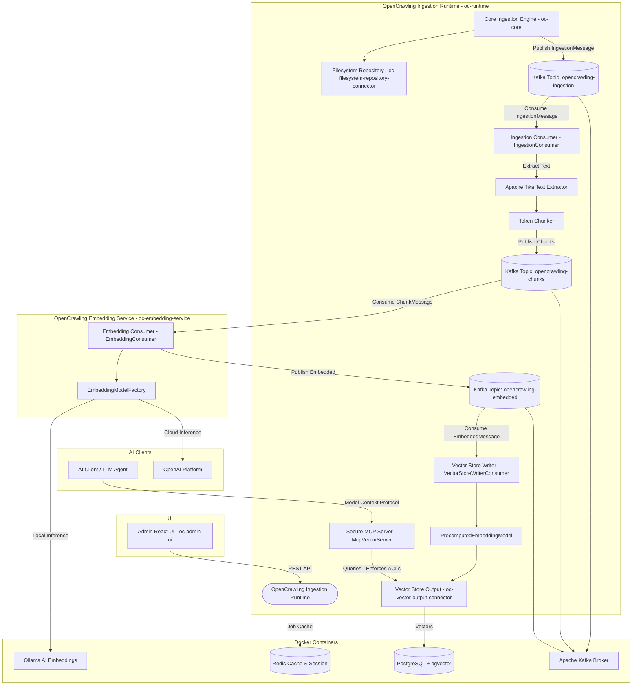
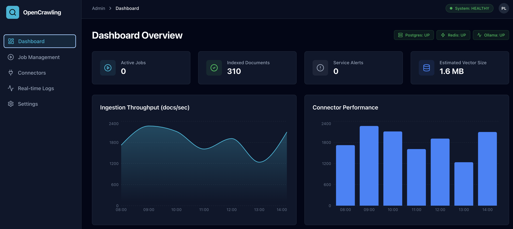
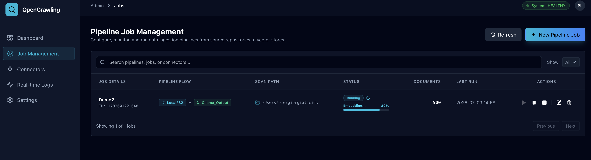
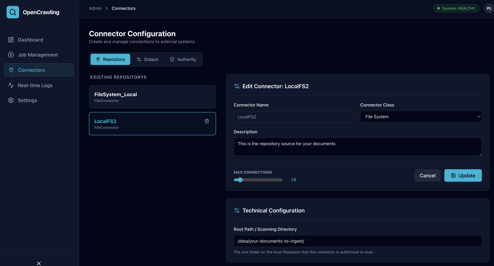
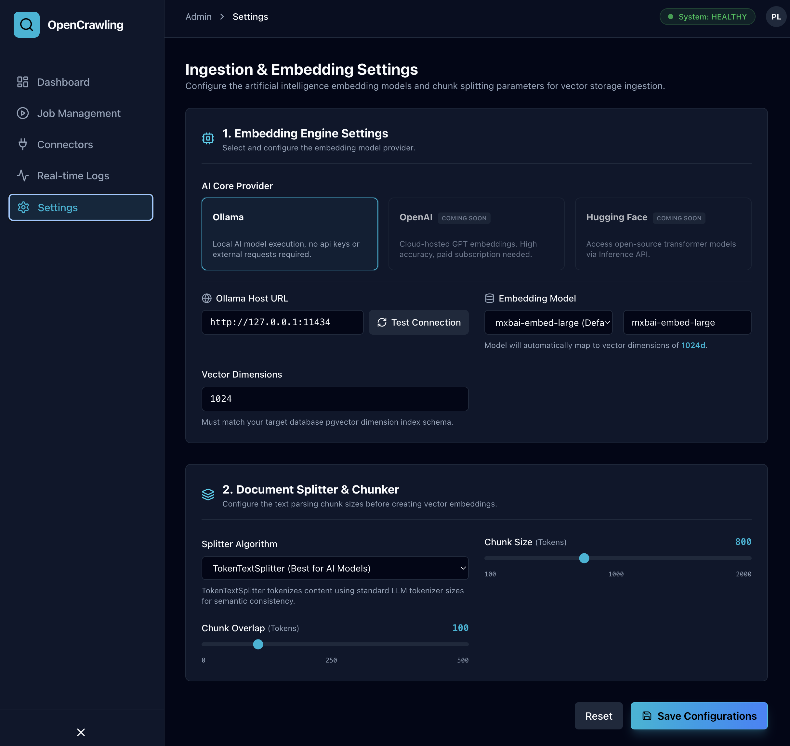
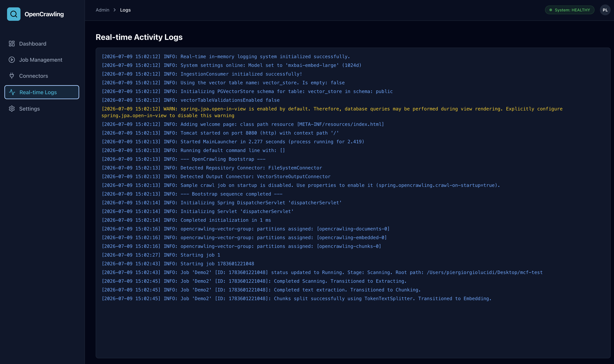

# OpenCrawling

[](LICENSE)
[](https://github.com/opencrawling/opencrawling/stargazers)
[](https://github.com/opencrawling/opencrawling/issues)
[](https://github.com/opencrawling/opencrawling/commits/main)
[](https://jdk.java.net/25/)
[](https://spring.io/projects/spring-boot)
[](https://spring.io/projects/spring-ai)
[](https://www.docker.com/)
[](https://kafka.apache.org/)
[](https://iceberg.apache.org/)
[](https://ozone.apache.org/)
[](https://tika.apache.org/)
[](https://www.alfresco.com/)
[](https://www.postgresql.org/)
[](https://milvus.io/)
[](https://redis.io/)
[](https://ollama.com/)
[](https://github.com/opencrawling/open-ingestion-standard)
[](https://modelcontextprotocol.io/)
[](https://opentelemetry.io/)
[](https://deepwiki.com/opencrawling/opencrawling)

**OpenCrawling** is the reference Java and Spring Framework implementation of the **[Open Ingestion Standard (OIS)](https://github.com/opencrawling/open-ingestion-standard)**. It provides a secure, decoupled, and vendor-neutral enterprise data integration platform leveraging modern Java 25 features (such as Structured Concurrency and Virtual Threads), Spring Boot, Spring AI, and vector search infrastructure to orchestrate data flows from various repository connectors to vector search outputs.

<p align="center">
  
</p>

---

## Architecture Diagram

The diagram below shows the high-level architecture of OpenCrawling, highlighting the newly decoupled, stateless embedding microservice and transformation connectors:



---

## Administration Dashboard (oc-admin-ui)

The `oc-admin-ui` provides a modern web-based administration console to monitor and configure your ingestion jobs.

### UI Screenshots

#### 📊 Telemetry Dashboard

*Real-time graphs monitoring job success rates, Kafka queue load, active crawling threads, and index ingestion speed.*

#### 📋 Job Pipeline Scheduler

*Schedule, monitor, start, and pause ingestion crawl tasks. Review document indexing status reports.*

#### 📁 Connector Configurations

*Manage endpoints and credentials for repositories (SharePoint, S3, Filesystem), output vectors, and transformation engines.*

#### ⚙️ Ingestion & Embedding Mappings

*Configure target models (e.g., Ollama, OpenAI) and tune text chunk sizes/overlap boundaries dynamically.*

#### 🪵 Real-Time Ingestion Logs

*Inspect live Java logging streams and Kafka consumer offsets to troubleshoot connector execution.*

---

## 🤖 AI-Powered Observability & Log Analysis (AIOps)

OpenCrawling incorporates **AI-Powered Observability (AIOps)** to automatically translate complex OpenTelemetry (OTel) distributed traces, Micrometer performance metrics, and Virtual Thread execution stack traces into plain, human-readable **Root Cause Analysis (RCA)** reports.

### Key Capabilities
- **Instant Root Cause Analysis (RCA)**: Click **"Diagnose with AI"** next to any pipeline job in `oc-admin-ui` to analyze OTel spans, identify exact failure points (e.g. database insertion timeouts, network latency), and receive actionable fix recommendations.
- **Correlated OpenTelemetry Spans**: All major pipeline stages (`Scanning`, `Extracting`, `Chunking`, `Embedding`, `Indexing`) record correlated OTel spans with timing breakdowns.
- **System MCP Tools**: Admin Copilot exposes native Model Context Protocol (MCP) tools for LLM diagnostic queries:
  - `fetch_job_traces(jobId)`: Retrieves correlated OTel spans and timing breakdowns per pipeline stage.
  - `get_error_logs(jobId, timeframe)`: Fetches failure logs and exception stack traces.
  - `query_throughput_metrics(connectorId)`: Queries throughput rates (docs/sec), P95 latency, and active virtual threads.

---

## Core Technologies

- **Java 25 Preview Features**: Structured Concurrency, Virtual Threads, and Pattern Matching.
- **Spring Boot & Spring AI**: High-performance backend orchestrating ingestion jobs and MCP Tool calling.
- **OpenTelemetry & Micrometer AIOps**: Automated Root Cause Analysis (RCA) and correlated distributed span telemetry.
- **Model Context Protocol (MCP)**: System tools exposing vector search and OTel telemetry to LLMs.
- **Apache Kafka**: Decoupled, event-driven document processing using the **Claim Check Pattern**.
- **pgvector**: High-dimensional vector similarity search in PostgreSQL.
- **Milvus**: High-performance, distributed vector database for large-scale enterprise vector indexing.
- **Redis Stack**: Lightweight caching and session management.
- **Ollama & OpenAI**: Dynamic embedding generation via local and cloud-based AI engines.
- **Vite + React + TailwindCSS**: Modern frontend administration dashboard with interactive AIOps diagnostic panels.

---

## Getting Started

### Prerequisites

Ensure you have the following installed on your machine:
- **JDK 25** (Ensure `JAVA_HOME` points to your JDK 25 directory)
- **Maven 3.9+**
- **Docker & Docker Compose**
- **Node.js 18+ & npm** (for the UI)

---

### Step-by-Step Setup

#### 1. Start Infrastructure (Docker)
Spin up the database, cache, message broker, and AI engine. Run from the project root:
```bash
docker compose up -d
```
**Services started:**
* **PostgreSQL (Port 5432)**: For job metadata, schema migrations, and pgvector storage.
* **Redis (Port 6379 / Insight Port 8001)**: For caching and session management.
* **Ollama (Port 11434)**: For local embeddings.
* **Apache Kafka (Port 9092)**: KRaft-mode broker for decoupled, event-driven document processing.

#### 2. Pull the Embedding Models (Ollama)

OpenCrawling supports configuring different embedding models on a per-job basis and automatically routes them to corresponding PgVector tables. To use the available options, make sure to pull the models you plan to utilize:

*   **mxbai-embed-large (1024-dim, default)**:
    ```bash
    docker exec -it ollama ollama pull mxbai-embed-large
    ```
*   **nomic-embed-text (768-dim)**:
    ```bash
    docker exec -it ollama ollama pull nomic-embed-text
    ```
*   **all-minilm (384-dim)**:
    ```bash
    docker exec -it ollama ollama pull all-minilm
    ```
*(Ollama will download the requested models in the background. Once pulled, OpenCrawling will automatically route them to `vector_store_1024`, `vector_store_768`, or `vector_store_384` respectively).*

---

### Option A: Run OpenCrawling in Docker Containers (Recommended)

To build and run the OpenCrawling backend runtime, the dynamic embedding microservice, and the administration UI as containerized services, run:

1. **Build the images**:
   ```bash
   docker compose -f docker-compose-apps.yml build
   ```

2. **Start the applications**:
   ```bash
   docker compose -f docker-compose-apps.yml up -d
   ```

* **Backend Service**: Access the backend runtime and integrated static resources at [http://localhost:8080](http://localhost:8080).
* **Embedding Service**: The dynamic microservice processes embeddings at [http://localhost:8082](http://localhost:8082).
* **Frontend Service**: Access the standalone React Administration Console at [http://localhost:3000](http://localhost:3000).

---

### Option A.2: Decoupled Multi-Service Deployment (Decoupled Microservices)

To run each microservice component (Repository Crawler, Ingestion Consumer, Embedding Consumer, Vector Store Writer, Secure MCP Server, and Admin UI) as a completely separate containerized process communicating over Kafka:

1. **Build the decoupled service images**:
   ```bash
   docker compose -f docker-compose-decoupled.yml build
   ```

2. **Start the complete decoupled pipeline**:
   ```bash
   docker compose -f docker-compose-decoupled.yml up -d
   ```

This spins up the database/event-stream dependencies alongside five decoupled OpenCrawling service containers. You can view logs, scale individual workers (e.g. `docker compose -f docker-compose-decoupled.yml scale oc-embedding-service=3`), and monitor the decoupled pipeline.

* **React Admin UI Console**: Access the administration dashboard at [http://localhost:3000](http://localhost:3000).
* **Secure MCP Server**: Connect your AI Client / IDE directly to [http://localhost:8080](http://localhost:8080) over SSE.

### Option A.3: Quick Start with Released Containers (Pre-built Release Distribution)

To run the complete decoupled pipeline using the official pre-built release containers from the GitHub Container Registry (without building the services locally):

1. **Start the release pipeline**:
   ```bash
   docker compose -f docker-compose-decoupled-dist.yml up -d
   ```

This pulls the official `ghcr.io/opencrawling/...` images directly, allowing you to spin up the entire architecture (Crawler, Ingestion, Embedding Service, Writer, MCP Server, and Admin UI) instantly.

### Option A.4: Decoupled Milvus-Based Deployment (Standalone + etcd + MinIO)

To run the complete decoupled pipeline configured to use Milvus instead of PostgreSQL/pgvector:

1. **Build the Milvus decoupled stack**:
   ```bash
   docker compose -f oc-milvus-output-connector/docker/docker-compose-decoupled-with-milvus.yml build
   ```

2. **Start the Milvus decoupled pipeline**:
   ```bash
   docker compose -f oc-milvus-output-connector/docker/docker-compose-decoupled-with-milvus.yml up -d
   ```

This starts the etcd, MinIO, and Milvus Standalone infrastructure alongside the decoupled OpenCrawling services. 

---

#### Running the Decoupled Integration Tests

We provide fully automated end-to-end integration test scripts that build, boot, test, and cleanse the entire decoupled environment:

*   **PGVector Decoupled Pipeline**:
    ```bash
    ./scripts/test-docker-decoupled.sh
    ```
    This script tests the decoupled architecture using PostgreSQL and pgvector, verifying database content directly.

*   **Milvus Decoupled Pipeline**:
    ```bash
    ./scripts/test-milvus-decoupled.sh
    ```
    This script tests the decoupled architecture using Milvus, querying the Milvus REST API to verify row ingestion and checking Secure MCP Server endpoints.

*   **Apache Ozone Object Storage Claim Check Pipeline**:
    ```bash
    ./scripts/test-ozone-decoupled.sh
    ```
    This script tests the decoupled architecture using Apache Ozone 2.2.0 (SCM, OM, Datanode, S3 Gateway) as the Claim Check Object Store for large document payloads.

---

### Option B: Run OpenCrawling Locally (Development Mode)

If you wish to run the JVM runtime and React frontend directly on your host machine for development:

#### 1. Build the Project (Maven)
Compile all modules using Java 25. Since we utilize advanced features, preview features must be enabled:
```bash
mvn clean install
```

#### 2. Run the Ingestion Runtime Bootstrap
Start the Spring Boot runtime application:
```bash
mvn spring-boot:run -pl oc-runtime -Dspring-boot.run.profiles=dev
```

#### 3. Run the Embedding Service Microservice
Start the Embedding Service application in a separate terminal:
```bash
mvn spring-boot:run -pl oc-embedding-service
```

##### Running a Sample Ingestion Job on Startup (Optional)
By default, the automatic startup crawl is disabled to prevent unnecessary scans. To trigger a demo crawl job on startup, pass the configuration properties:
```bash
mvn spring-boot:run -pl oc-runtime -Dspring-boot.run.profiles=dev \
  -Dspring-boot.run.arguments="--spring.opencrawling.crawl-on-startup=true --spring.opencrawling.scan-path=/your/local/directory/to/scan"
```

#### 4. Run the Admin UI
To launch the administration dashboard:
```bash
cd oc-admin-ui
npm install
npm run dev
```
Open [http://localhost:5173](http://localhost:5173) in your browser.

---

## Scaling Out & Performance

OpenCrawling is designed for high-throughput, horizontal scalability. Since the ingestion pipeline is decoupled using **Apache Kafka** and the **Claim Check Pattern**, you can scale components independently.

### 1. Scaling the Ingestion / Processing (Output Connector)
Vector indexing and embedding generation is typically the primary performance bottleneck because of deep learning model inference (Ollama/OpenAI) and database indexing (pgvector).
* **Kafka Consumer Group Partitioning**: The three main topics (`opencrawling-ingestion`, `opencrawling-chunks`, and `opencrawling-embedded`) are consumed by `IngestionConsumer`, `EmbeddingConsumer` (in `oc-embedding-service`), and `VectorStoreWriterConsumer` respectively within the OpenCrawling services. By configuring these topics with multiple partitions, Kafka distributes load dynamically among active consumer nodes.
* **Horizontal Scaling of Service Instances**: You can run multiple instances of the `oc-embedding-service` application sharing the same consumer group. Kafka automatically distributes partitions and load-balances the messages.
* **Ollama Load Balancing**: Scale out embedding generation by pointing `baseUrl` to a load balancer (e.g., NGINX, HAProxy) backed by a cluster of Ollama instances running on GPU-enabled nodes.

### 2. Scaling the Repository Connectors (Ingestion Source)
The scanning/crawling phase can be distributed by splitting large target sources:
* **Partitioned Scans**: Run separate bootstrap crawl jobs targeting different sub-directories or repository prefixes.
* **Distributed File Shares / Shared Storage**: In a multi-node setup, ensure the `IngestionConsumer` instances have access to the same shared filesystem (e.g., NFS, S3/MinIO bucket, SMB) as the repository crawlers, so the Claim Check reference (path/URI) can be successfully resolved by the consumer node.

### 3. Claim Check Pattern
To ensure the messaging system remains fast and responsive:
1. The **Repository Connector** crawls data, but instead of publishing the entire document content (which could be megabytes of binary data) to Kafka, it saves/references the file on a shared storage medium.
2. It publishes a lightweight `IngestionMessage` (Claim Check record) to the Kafka topic containing the metadata (URI, file path, version).
3. The **Consumer Workers** process the ingestion:
   * **`IngestionConsumer`** pulls the reference, reads the file directly from storage, extracts text with **Apache Tika**, splits it into semantic chunks, and publishes them to the chunks topic.
   * **`EmbeddingConsumer`** (running in the `oc-embedding-service` microservice) pulls the chunks, reads the dynamically configured Transformation Connector engine configurations, requests embedding vectors from the target model engine (Ollama, OpenAI, Hugging Face, etc.), and publishes the embedded chunks to the embedded topic.
   * **`VectorStoreWriterConsumer`** consumes embedded chunks and uses a stateless `PrecomputedEmbeddingModel` to save them directly to pgvector.

---

## Verification & Monitoring

- **Database**: Access PostgreSQL at `localhost:5432` (User: `opencrawling`, DB: `opencrawling`).
- **Redis Dashboard**: Open [http://localhost:8001](http://localhost:8001) in your browser to view the Redis Stack Insight dashboard.
- **Logs**: Monitor console output for the Virtual Thread Executor and Structured Concurrency task logs.

---

## Troubleshooting

- **Java Version Check**: Run `java -version` to confirm you are using Java 25.
- **Preview Features**: If your IDE fails to compile structured concurrency code, verify that the `--enable-preview` JVM argument is configured for compiler and runtime settings. (It is already pre-configured in `pom.xml`).

---

## 📬 Contact & Support

Join our [Slack Community](https://join.slack.com/t/opencrawling/shared_invite/zt-43r2anb6q-YLoBsOrxCCcBWU5Up3P1rw) to chat with developers, share feedback, or ask configuration questions.

For general inquiries, community updates, or security-sensitive disclosures, please contact the maintainers at [info@opencrawling.org](mailto:info@opencrawling.org).

---

## Trademark

OpenCrawling&reg; is a registered trademark of the OpenCrawling Organization. For guidelines on using the name and logo, please refer to the [TRADEMARK.md](TRADEMARK.md) file.
