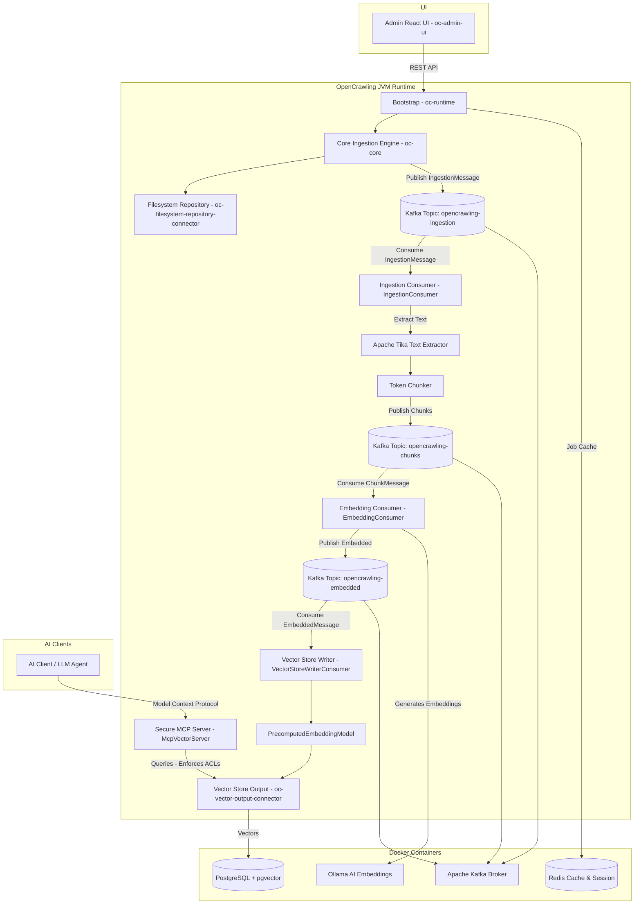

# OpenCrawling

[](LICENSE)
[](https://jdk.java.net/25/)
[](https://spring.io/projects/spring-boot)
[](https://www.docker.com/)
[](https://kafka.apache.org/)
[](https://www.postgresql.org/)
[](https://redis.io/)
[](https://github.com/OpenPj/spring-manifold-next-gen/stargazers)
[](https://github.com/OpenPj/spring-manifold-next-gen/issues)
[](https://github.com/OpenPj/spring-manifold-next-gen/pulls)


**OpenCrawling** is an enterprise data integration and ingestion platform modeled after Apache ManifoldCF. It leverages modern Java 25 features (such as Structured Concurrency and Virtual Threads), Spring Boot, and vector search infrastructure to orchestrate data flows from various repository connectors to vector search outputs.

<p align="center">
  
</p>

---

## Architecture Diagram

The diagram below shows the high-level architecture of OpenCrawling:



---

## Administration Dashboard (oc-admin-ui)

The `oc-admin-ui` provides a modern web-based administration console to monitor and configure your ingestion jobs.

### UI Screenshots

#### 📊 Telemetry Dashboard

*Real-time graphs monitoring job success rates, Kafka queue load, active crawling threads, and index ingestion speed.*

#### 📋 Job Pipeline Scheduler

*Schedule, monitor, start, and pause ingestion crawl tasks. Review document indexing status reports.*

#### 📁 Connector Configurations

*Manage endpoints and credentials for repositories (SharePoint, S3, Filesystem) and vector search destinations.*

#### ⚙️ Ingestion & Embedding Mappings

*Configure target models (e.g., Ollama, OpenAI) and tune text chunk sizes/overlap boundaries dynamically.*

#### 🪵 Real-Time Ingestion Logs

*Inspect live Java logging streams and Kafka consumer offsets to troubleshoot connector execution.*

---

## Core Technologies

- **Java 25 Preview Features**: Structured Concurrency, Virtual Threads, and Pattern Matching.
- **Spring Boot & Spring AI**: High-performance backend orchestrating ingestion jobs.
- **Apache Kafka**: Decoupled, event-driven document processing using the **Claim Check Pattern**.
- **pgvector**: High-dimensional vector similarity search in PostgreSQL.
- **Redis Stack**: Lightweight caching and session management.
- **Ollama**: Local AI embedding generation via open-source LLM models.
- **Vite + React + TailwindCSS**: Modern frontend administration dashboard.

---

## Getting Started

### Prerequisites

Ensure you have the following installed on your machine:
- **JDK 25** (Ensure `JAVA_HOME` points to your JDK 25 directory)
- **Maven 3.9+**
- **Docker & Docker Compose**
- **Node.js 18+ & npm** (for the UI)

---

### Step-by-Step Setup

#### 1. Start Infrastructure (Docker)
Spin up the database, cache, message broker, and AI engine. Run from the project root:
```bash
docker compose up -d
```
**Services started:**
* **PostgreSQL (Port 5432)**: For job metadata, schema migrations, and pgvector storage.
* **Redis (Port 6379 / Insight Port 8001)**: For caching and session management.
* **Ollama (Port 11434)**: For local embeddings.
* **Apache Kafka (Port 9092)**: KRaft-mode broker for decoupled, event-driven document processing (internal container communication on port `9094`).

#### 2. Pull the Embedding Model (Ollama)
The platform is configured to use the `mxbai-embed-large` model for embeddings. 
Currently the model should be pulled automagically but if you have issues, you have to pull it once by yourself:
```bash
docker exec -it ollama ollama pull mxbai-embed-large
```
*(You can exit the prompt with `Ctrl+D` once the download starts; Ollama will keep downloading in the background).*

---

### Option A: Run OpenCrawling in Docker Containers (Recommended)

To build and run the OpenCrawling backend runtime and administration UI as containerized services, run:

1. **Build the images**:
   ```bash
   docker compose -f docker-compose-apps.yml build
   ```

2. **Start the applications**:
   ```bash
   docker compose -f docker-compose-apps.yml up -d
   ```

* **Backend Service**: Access the backend runtime and integrated static resources at [http://localhost:8080](http://localhost:8080).
* **Frontend Service**: Access the standalone React Administration Console at [http://localhost:3000](http://localhost:3000).

---

### Option B: Run OpenCrawling Locally (Development Mode)

If you wish to run the JVM runtime and React frontend directly on your host machine for development:

#### 1. Build the Project (Maven)
Compile all modules using Java 25. Since we utilize advanced features, preview features must be enabled:
```bash
mvn clean install
```

#### 2. Run the Runtime Bootstrap
Start the Spring Boot runtime application:
```bash
mvn spring-boot:run -pl oc-runtime -Dspring-boot.run.profiles=dev
```

##### Running a Sample Ingestion Job on Startup (Optional)
By default, the automatic startup crawl is disabled to prevent unnecessary scans. To trigger a demo crawl job on startup, pass the configuration properties:
```bash
mvn spring-boot:run -pl oc-runtime -Dspring-boot.run.profiles=dev \
  -Dspring-boot.run.arguments="--spring.opencrawling.crawl-on-startup=true --spring.opencrawling.scan-path=/your/local/directory/to/scan"
```

#### 3. Run the Admin UI
To launch the administration dashboard:
```bash
cd oc-admin-ui
npm install
npm run dev
```
Open [http://localhost:5173](http://localhost:5173) in your browser.
---

## Scaling Out & Performance

OpenCrawling is designed for high-throughput, horizontal scalability. Since the ingestion pipeline is decoupled using **Apache Kafka** and the **Claim Check Pattern**, you can scale components independently.

### 1. Scaling the Ingestion / Processing (Output Connector)
Vector indexing and embedding generation is typically the primary performance bottleneck because of deep learning model inference (Ollama) and database indexing (pgvector).
* **Kafka Consumer Group Partitioning**: The three main topics (`opencrawling-ingestion`, `opencrawling-chunks`, and `opencrawling-embedded`) are consumed by `IngestionConsumer`, `EmbeddingConsumer`, and `VectorStoreWriterConsumer` respectively within the `oc-runtime` service. By configuring these topics with multiple partitions, Kafka distributes load dynamically among active consumer nodes.
* **Horizontal Scaling of Runtime Instances**: You can run multiple instances of the `oc-runtime` application sharing the same `spring.application.name` and consumer group (`opencrawling-vector-group`). Kafka automatically distributes partitions and load-balances the messages.
* **Ollama Load Balancing**: Scale out embedding generation by pointing `spring.ai.ollama.base-url` to a load balancer (e.g., NGINX, HAProxy) backed by a cluster of Ollama instances running on GPU-enabled nodes.

### 2. Scaling the Repository Connectors (Ingestion Source)
The scanning/crawling phase can be distributed by splitting large target sources:
* **Partitioned Scans**: Run separate bootstrap crawl jobs targeting different sub-directories or repository prefixes.
* **Distributed File Shares / Shared Storage**: In a multi-node setup, ensure the `IngestionConsumer` instances have access to the same shared filesystem (e.g., NFS, S3/MinIO bucket, SMB) as the repository crawlers, so the Claim Check reference (path/URI) can be successfully resolved by the consumer node.

### 3. Claim Check Pattern
To ensure the messaging system remains fast and responsive:
1. The **Repository Connector** crawls data, but instead of publishing the entire document content (which could be megabytes of binary data) to Kafka, it saves/references the file on a shared storage medium.
2. It publishes a lightweight `IngestionMessage` (Claim Check record) to the Kafka topic containing the metadata (URI, file path, version).
3. The **Consumer Workers** process the ingestion:
   * **`IngestionConsumer`** pulls the reference, reads the file directly from storage, extracts text with **Apache Tika**, splits it into semantic chunks, and publishes them to the chunks topic.
   * **`EmbeddingConsumer`** pulls the chunks, requests embedding vectors from **Ollama**, and publishes the embedded chunks to the embedded topic.
   * **`VectorStoreWriterConsumer`** consumes embedded chunks and uses a `PrecomputedEmbeddingModel` to save them directly to pgvector.

---

## Verification & Monitoring

- **Database**: Access PostgreSQL at `localhost:5432` (User: `opencrawling`, DB: `opencrawling`).
- **Redis Dashboard**: Open [http://localhost:8001](http://localhost:8001) in your browser to view the Redis Stack Insight dashboard.
- **Logs**: Monitor console output for the Virtual Thread Executor and Structured Concurrency task logs.

---

## Troubleshooting

- **Java Version Check**: Run `java -version` to confirm you are using Java 25.
- **Preview Features**: If your IDE fails to compile structured concurrency code, verify that the `--enable-preview` JVM argument is configured for compiler and runtime settings. (It is already pre-configured in `pom.xml`).

---

## Trademark

OpenCrawling&reg; is a registered trademark of the OpenCrawling Organization. For guidelines on using the name and logo, please refer to the [TRADEMARK.md](TRADEMARK.md) file.

